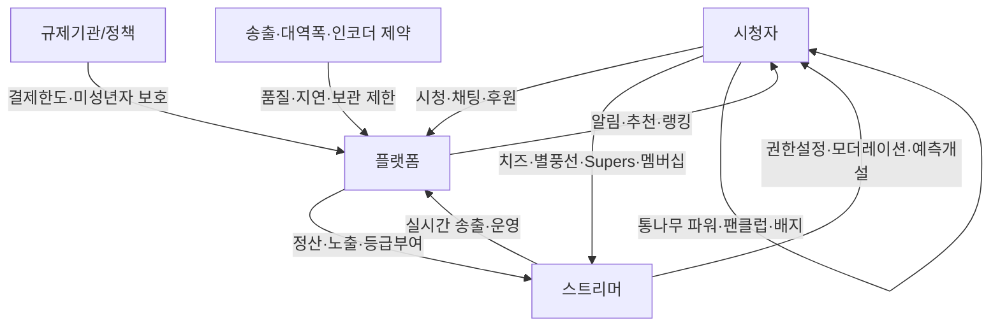
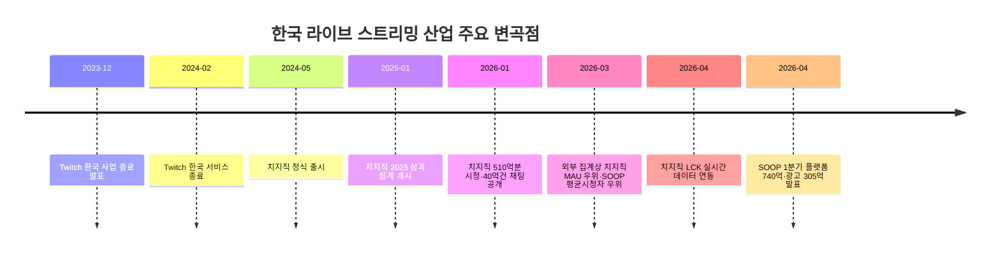

# Phase 2 보강 조사 보고서

## Executive Summary

Phase 1의 기준선은 총 80 facts, Actor 12·Resource 12·Activity 12·Constraint 16·Feedback 12·Time-axis 16, 출처 밀도는 A 73·C 2·D 5, 유일성 태그는 ★ 62·— 18, 검증 필요 관찰은 4건, 미포화 축은 없음이었다. 본 Phase 2는 이 기준선을 재기재하고, 사용자가 지정한 CHART v5의 “진단+보강” 형식에 맞춰 공식 문서 우선으로 재검증했다. fileciteturn0file0

핵심 보강 결과는 세 가지다. 첫째, **행위자-자원-활동의 결합 구조**는 공식 고객센터 문서만으로도 더 촘촘히 확인됐다. 치지직은 통나무 파워·승부예측·스트리머샵을 통해 시청 활동, 후원, 커머스 노출을 한 채널 안에서 결합하고, SOOP은 별풍선·스티커·베스트 스트리머 등급과 채팅 권한을 결합하며, YouTube Live는 라이브 채팅·Supers·멤버십·모더레이터 권한을 결합한다. 둘째, **제약 구조**는 플랫폼 자체 규칙과 공적 규제가 중첩된다. 치지직은 1080p·8Mbps·60fps 상한과 초과 송출 5분 정지를 명시하고, YouTube는 연령·지연모드·보관시간·수익화 자격을 명시하며, 국내 규제는 유료후원 1일 100만원 한도와 미성년자 보호 절차를 요구한다. 셋째, **U-01~U-04는 전부 완전 해소되지 않았다.** 다만 치지직·SOOP의 2026년 3월 MAU와 평균 시청자 수는 외부 패널 자료로 부분 확인됐고, YouTube Live 한국 단독 지표는 이번 조사 범위에서 공시·공식 공개값을 찾지 못했다. citeturn26view0turn27view1turn27view2turn28view0turn8view0turn8view1turn8view2turn36view0turn12view0turn14view0turn15view0turn6view2turn13view3turn15view1turn16view0turn17view0turn20view0

## Phase 1 기준 재기재와 정규화 원칙

이번 보강은 2026년 6월 23일 기준으로 수행했고, 우선순위는 A등급 공식 문서·정책·플랫폼 공지, 다음으로 B 인터뷰·발언, C 직접 관찰 기록, D 산업 기사·리포트 순으로 적용했다. 실제 확보는 A 비중이 압도적이었고, B는 공개 원문 접근성이 낮아 제한적이었으며, C는 SOOP 앱 이용자 리뷰 2건으로만 보강됐다. citeturn22view0turn31view0turn40view0

지표 정규화는 “가장 최근 공개값”을 우선 사용했고, 월간값이 직접 없을 때만 **연간÷12** 또는 **분기÷3**의 단순 환산을 표시했다. 따라서 치지직의 월간 총시청시간은 2025년 연간 510억 분을 12로 나눈 값이고, SOOP의 플랫폼 매출은 2026년 1분기 740억원을 3으로 나눈 값이다. 이 환산은 비교 편의를 위한 산술 정규화이지, 플랫폼이 직접 공시한 ‘해당 월 실적’은 아니다. citeturn6view0turn40view1

## 플랫폼별 핵심 지표 정규화

| 플랫폼 | 기준시점 | MAU | 평균 동시시청자 | 월간 총시청시간 | 플랫폼 매출·후원총액 | 수익화 대상 창작자 수 | 평균 후원 수익률 |
|---|---|---:|---:|---:|---|---|---|
| 치지직 | 2026-03 / 2025년 | 355만 citeturn20view0 | 약 3.7만 citeturn20view0 | 약 42.5억분(510억÷12) citeturn6view0 | 분리 공시값 미확인 | 미공시 | 미공시 |
| SOOP | 2026-03 / 2026 Q1 | 약 230만 citeturn20view0 | 약 6만 citeturn20view0 | 공개값 미확인 | 플랫폼 매출 약 247억원/월(740억÷3) citeturn40view1 | 미공시 | 전체 평균 미공시, 베스트 스트리머 특례 70원/별풍선 공개 citeturn36view0 |
| YouTube Live 한국 | 2026-06 확인 범위 | 공개값 미확인 | 공개값 미확인 | 공개값 미확인 | 한국 Live 단독 공개값 미확인 | 공개값 미확인 | Supers 70% 규칙은 공개, 한국 Live 평균치는 미공시 citeturn6view2 |

간단 비교 차트는 MAU와 평균 동시시청자만 작성할 수 있다. 치지직은 2026년 3월 MAU에서 SOOP을 앞섰고, SOOP은 같은 시점 외부 집계 평균 시청자 수에서 치지직을 앞섰다. citeturn20view0

```text
MAU(2026-03)        치지직 355만 ████████
                    SOOP   230만 █████

평균 동시시청자     SOOP   6.0만 ██████
(2026-03, 외부집계) 치지직 3.7만 ████
```

## 축별 검증과 보강

**Actor.** 새로 확보한 사실은 다음과 같다. ① 치지직은 스트리머 본인 또는 연관 회사의 스마트스토어만 연결하도록 하고, 스마트스토어 판매자가 커머스 솔루션에서 연결을 허용해야 한다. ② SOOP 시청자는 별풍선을 선물하면 팬클럽에 가입하고, 스트리머는 별풍선을 현금성 수익으로 환전한다. ③ YouTube는 표준 모더레이터와 관리 모더레이터를 구분한다. ④ SOOP 베스트 스트리머는 별도 현금화 우대와 유지 요건을 가진다. 재확인된 Phase 1 항목은 A-05, A-07, A-08, A-12다. 여전히 검증이 필요한 항목은 “플랫폼 간 창작자 다중소속 비율”과 “한국 YouTube Live 수익화 창작자 수”다. citeturn28view0turn8view0turn12view0turn36view0

**Resource.** ① 치지직 통나무 파워는 5분 시청, 1시간 인증 시청, 팔로우, 후원, 구독 선물에 수량 규칙을 부여한다. ② 치지직 구독자는 시청 기반 통나무 파워에 1.2배 또는 2배 보너스를 받는다. ③ YouTube는 Supers 확인매출의 70%를 창작자에게 배분한다. ④ SOOP의 2026년 1분기 플랫폼 매출은 740억원, 광고 매출은 305억원이었다. 재확인된 Phase 1 항목은 R-02, R-05, R-11이다. 여전히 검증이 필요한 항목은 “치지직 후원 실수령률”과 “SOOP 전체 BJ 평균 환전률”이다. citeturn26view0turn6view2turn40view1

**Activity.** ① 치지직 승부예측은 스트리머가 주제를 열고, 시청자가 통나무 파워를 걸고, 스트리머가 결과를 확정한다. ② 치지직은 지원 범위를 넘겨 송출하면 5분 정지한다. ③ SOOP은 채팅 동결·저속 모드·등급별 채팅 허용을 스트리머와 매니저가 조정한다. ④ YouTube는 동일 콘텐츠의 다중 플랫폼 동시송출을 허용하고 업로드 대역폭 총합 관리와 스트림 헬스 모니터링을 요구한다. 재확인된 Phase 1 항목은 AC-01, AC-07, AC-09, AC-10, C-01이다. 여전히 검증이 필요한 항목은 “치지직 파티의 실제 동시연결 한도”다. citeturn27view2turn27view1turn8view2turn32view0

**Constraint.** ① 국내 가이드라인은 유료후원 1일 100만원 이하 한도와 기술적 차단을 요구한다. ② 같은 가이드라인은 미성년자 결제에 법정대리인 동의와 사후 고지를 요구한다. ③ 치지직은 만 14세 미만 스튜디오 가입을 금지하고, 미성년자에게 19세 연령제한 방송 설정을 금지한다. ④ YouTube는 단독 라이브 최소 연령을 16세로 두고, 13~15세 단독 노출 시 채팅·기능 제한 가능성을 고지한다. ⑤ SOOP 앱 리뷰에는 모바일 무한로딩·광고 반복 노출 관찰이 남아 있다. 재확인된 Phase 1 항목은 C-05~C-10, C-15~C-16이다. 여전히 검증이 필요한 항목은 “플랫폼별 광고 빈도·중간광고 규칙의 동일 기준 비교값”이다. citeturn16view0turn29view2turn29view3turn13view3turn22view0

**Feedback.** ① 치지직 통나무 파워는 랭킹과 예측 참여를 결합하고, 기능 비활성화 후에도 기존 포인트를 남긴다. ② SOOP 별풍선은 팬클럽·열혈팬·본방 입장 권한으로 되먹임된다. ③ SOOP 베스트 스트리머는 환전 단가 우대와 월 최소 방송 5일·15시간 유지 요건을 가진다. ④ YouTube Super Chat은 금액에 따라 색상과 상단 고정 시간이 달라진다. ⑤ 치지직 팔로우는 생방송 시작·새 동영상 알림으로 복귀 트래픽을 만든다. 재확인된 Phase 1 항목은 F-01~F-11이다. 여전히 검증이 필요한 항목은 “구독 유지율”과 “후원→재방문 전환율”이다. citeturn26view0turn26view1turn8view0turn36view0turn15view0turn29view1

**Time-axis.** ① Twitch는 2023년 12월 5일 한국 사업 종료를 발표하고 2024년 2월 27일 종료 일정과 창작자 커뮤니티 이전 지원 방침을 밝혔다. ② 치지직은 2024년 5월 정식 출시했고, 2026년 1월 기준 2025년 총 시청시간 510억분과 채팅 40억건을 공표했다. ③ 치지직은 2026년 4월 LCK 공식 중계와 같이보기에 GRID 기반 실시간 데이터 기능을 붙였다. ④ SOOP은 2025년 플랫폼 매출 비중 70.9%, 2026년 1분기 플랫폼 매출 740억원·광고 매출 305억원을 기록했다. ⑤ 2026년 3월 외부 집계상 치지직은 MAU 우위, SOOP은 평균 시청자 수 우위를 보였다. 재확인된 Phase 1 항목은 T-03, T-04, T-07, T-13, T-16이다. 여전히 검증이 필요한 항목은 “월별 플랫폼 간 실제 이동 코호트”다. citeturn31view0turn5view0turn6view0turn6view1turn21view1turn40view1turn20view0

## 관계망과 시간축

아래 도식은 이번 Phase 2에서 재확인된 공식 규칙을 관계망으로 압축한 것이다. 치지직은 통나무 파워·예측·커머스 결합, SOOP은 별풍선·스티커·등급·채팅권한 결합, YouTube는 Supers·멤버십·모더레이션 결합이 중심이다. citeturn26view0turn27view2turn28view0turn8view0turn8view1turn8view2turn36view0turn12view0turn14view0turn15view0turn6view2



아래 타임라인은 최근 변곡점을 시간순으로 정리한 것이다. citeturn31view0turn5view0turn6view0turn6view1turn40view1turn20view0



## U-01~U-04 검증 상태와 출처 분포

U-01 **교차 이용률/동시 다중 시청**은 해소되지 않았다. 근거는 2026년 3월 기준 치지직·SOOP의 MAU와 평균 시청자 수는 외부 패널 기사로 확인되지만, 동일 개인의 중복 이용률이나 동시 다중 시청률은 공개되지 않았기 때문이다. 추가로 필요한 것은 디바이스 패널의 중복 식별자 또는 플랫폼 로그 연계 설문이다. citeturn20view0

U-02 **스트리머 이동과 시청자 이동의 연결**도 해소되지 않았다. Twitch는 한국 창작자 커뮤니티를 대체 플랫폼으로 옮기도록 지원하겠다고 밝혔고, 국내 기사들은 치지직과 SOOP의 경쟁을 설명하지만, 특정 스트리머 이동 뒤 해당 시청자 코호트가 어느 플랫폼으로 이동했는지를 잇는 공개 패널 데이터는 제시하지 않는다. 추가로 필요한 것은 채널 단위 코호트 추적 또는 이동 스트리머 심층 인터뷰다. citeturn31view0turn21view1

U-03 **한국 YouTube Live 단독 MAU·시청시간·매출**은 이번 조사 범위에서 해소되지 않았다. 확인된 YouTube 공식 문서는 라이브 기능, 연령, 보관, 멤버십, Supers 수익배분 규칙은 설명하지만 한국 Live 단독 이용량·매출은 제시하지 않았다. 추가로 필요한 것은 YouTube Korea의 지역별 라이브 지표 공시 또는 외부 패널의 라이브 탭 분리 데이터다. citeturn13view1turn13view3turn14view0turn6view2

U-04 **후원 실수령률·환불률·광고노출량·구독 유지율의 동일 기준 비교**는 부분 해소에 그쳤다. YouTube는 Supers의 70% 배분 규칙을 공개했고, SOOP은 베스트 스트리머 특례 환전단가 70원/별풍선을 공개했지만, 치지직 공개 문서에서는 창작자 실수령률을 확인하지 못했고 세 플랫폼의 환불률·광고노출량·구독 유지율을 같은 기준으로 비교한 자료도 찾지 못했다. 추가로 필요한 것은 창작자 정산서 표본, 플랫폼 약관 원문, 광고 로그 또는 구독 코호트 데이터다. citeturn6view2turn36view0turn22view0

축별 새 사실의 출처 분포는 아래와 같다. B등급이 비어 있는 것은 공개 인터뷰 원문 접근성이 낮았기 때문이며, 이번 Phase 2의 보강은 사실상 A·D 중심이었다. citeturn22view0turn40view0

| 축 | A | B | C | D | E | 합계 |
|---|---:|---:|---:|---:|---:|---:|
| Actor | 4 | 0 | 0 | 0 | 0 | 4 |
| Resource | 3 | 0 | 0 | 1 | 0 | 4 |
| Activity | 4 | 0 | 0 | 0 | 0 | 4 |
| Constraint | 4 | 0 | 1 | 0 | 0 | 5 |
| Feedback | 5 | 0 | 0 | 0 | 0 | 5 |
| Time-axis | 3 | 0 | 0 | 2 | 0 | 5 |

주요 원문 링크는 본문 인용 자체에 연결되어 있다. 특히 한국어 우선 핵심 원문은 네이버 치지직 고객센터·보도자료, 방송통신위원회/생활법령, SOOP 공식 아이템·서비스 페이지, 그리고 외부 비교지표로서 딜사이트와 인벤 기사다. citeturn26view0turn28view0turn16view0turn17view0turn8view0turn8view2turn20view0turn40view0