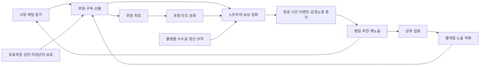
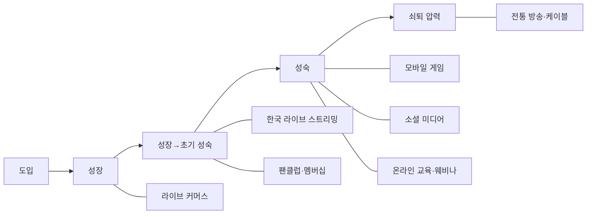

# Phase 3 구조화된 목적 리포트

## Executive Summary

이 보고서는 한국 라이브 스트리밍 산업을 기준점으로 두고, 동형 후보 산업을 **모바일 게임, 소셜 미디어 라이브·숏폼 플랫폼, 라이브 커머스, 팬클럽·멤버십 플랫폼, 온라인 교육·웨비나, 전통 방송·케이블**의 여섯 개로 선정해 SMT 3단계로 비교했다. 결론부터 말하면, 한국 라이브 스트리밍은 **표면적으로는 방송과 닮아 보이지만**, 관계 구조와 체계성 단계로 올라갈수록 **소셜 미디어 + 모바일 게임 + 팬멤버십**의 혼합형에 더 가깝다. 특히 핵심 엔진은 “실시간 상호작용 → 공개적 후원/구독 → 랭킹·재노출 → 재방문”의 되먹임이며, 이 점은 방송보다 플랫폼형 디지털 산업과의 구조적 유사성이 훨씬 크다. fileciteturn0file0 fileciteturn0file1 citeturn13academia3turn35view1turn36view2turn38view0

구조적 대응성이 가장 강한 산업은 **소셜 미디어**와 **모바일 게임**이다. 소셜 미디어는 추천 알고리즘, 팔로우·알림, 상위 집중, 브랜드 광고와 크리에이터 수익화가 라이브 스트리밍과 거의 동일한 관계 구조를 만든다. 모바일 게임은 고빈도 세션, 이벤트, 랭킹, 소수 고과금 이용자 의존, 잔존율 최적화의 체계성이 라이브 스트리밍의 후원경제와 가장 가까운 경제적 압력을 제공한다. 반대로 전통 방송·케이블은 편성, 광고, 스폰서십 같은 표면 속성은 닮았지만, 실시간 양방향성과 창작자-팬 직접 결제 구조가 약해 SMT 2·3단계에서는 가장 멀어진다. citeturn35view1turn36view2turn39view2turn44view0turn22news5

피드백 축에서 가장 중요한 결론은, 라이브 스트리밍의 후원경제가 **강력하지만 자기제한적**이라는 점이다. 공개적 후원은 재방문·참여를 촉진하지만, 후원 행위 자체는 희소하고 집중적이며, 빈번한 고액 후원자에 의한 선물이 오히려 ‘pay-it-forward’를 약화시키는 경우가 확인된다. 또한 VTuber 슈퍼챗 경제 분석에서는 수익이 극도로 불평등하고 기관·플랫폼 집중도가 커지는 경향이 나타났다. 한국에서는 여기에 더해 유료후원 1일 100만원 한도 같은 규범적 상한이 존재한다. 즉 라이브 스트리밍의 핵심 loop는 성장 엔진이면서 동시에 장기적으로는 **후원 피로, 상위 집중, 플랫폼 의존, 재분배 한계**를 통해 자체 제동을 건다. citeturn36view0turn36view1turn36view5turn32academia0 fileciteturn0file1

산업 수명주기 관점에서는 한국 라이브 스트리밍을 **성장 후반부에서 초기 성숙기로 이동 중인 시장**으로 보는 해석이 가장 타당하다. Twitch 한국 철수 이후 치지직과 SOOP 중심으로 시장 재편이 진행되었고, 이용자 저변과 시청시간은 확대되었지만, 창작자 정산의 투명성과 플랫폼별 후원 분포, 한국 YouTube Live의 독립 지표 등은 여전히 불완전하다. 이에 비해 모바일 게임과 소셜 미디어는 성숙기, 방송·케이블은 쇠퇴 압력 국면, 라이브 커머스와 팬멤버십은 성장~초기 성숙, 온라인 교육·웨비나는 팬데믹 급성장 이후 재편형 성숙기에 가깝다. fileciteturn0file1 citeturn39view1turn39view0turn38view5turn30news1turn44view0

## 비교 대상 선정과 분석 프레임

이번 Phase 3의 비교 산업은 “한국 라이브 스트리밍과 어느 정도까지 **표면 속성**, **관계 구조**, **체계성/인과 사슬**이 대응되는가”를 기준으로 골랐다. 선정 우선순위는 다음 세 가지였다. 첫째, 실시간 혹은 준실시간 참여 구조가 있는가. 둘째, 플랫폼-창작자-이용자-광고주/브랜드/결제수단이 얽힌 다면시장인가. 셋째, 반복 이용과 수익화의 되먹임이 명시적으로 존재하는가. 이 기준으로 보면 라이브 스트리밍은 단순한 “디지털 방송”이 아니라, **소셜 추천**, **게임형 retention 설계**, **팬 직접결제**, **실시간 상거래**가 결합된 혼성 산업에 가깝다. fileciteturn0file0 citeturn13academia3turn35view1turn36view2turn43view1turn38view0

선정 결과는 아래와 같다.

| 비교 산업 | 선정 이유 | 비고 |
|---|---|---|
| 모바일 게임 | 고빈도 세션, 랭킹·이벤트, 소수 고과금 의존, 잔존율 최적화가 라이브 스트리밍의 후원·재방문 구조와 가장 가깝다. citeturn36view2turn28academia1turn39view1 | 핵심 동형 |
| 소셜 미디어 라이브·숏폼 | 추천 알고리즘·팔로우·브랜드 수익화·상위 집중이 라이브 스트리밍의 attention market과 거의 동일하다. citeturn35view1turn37view0turn39view2turn44view0 | 핵심 동형 |
| 라이브 커머스 | “실시간 진행자 + 채팅 + 구매 전환” 구조가 라이브 스트리밍의 실시간 상호작용과 직접 대응한다. citeturn40view0turn43view0turn43view1 | 핵심 동형 |
| 팬클럽·멤버십 플랫폼 | 광고보다 직접 결제와 팬 관계 유지가 중심이라는 점에서 후원경제 비교에 필수적이다. citeturn38view0turn38view1turn46view0 | 핵심 동형 |
| 온라인 교육·웨비나 | 동시 접속, 강사-수강자 상호작용, 출석·완주·전환 설계가 비교 가능하다. citeturn38view4turn42view0turn42view1turn31academia7 | 부분 동형 |
| 전통 방송·케이블 | 편성·광고·권리·생중계라는 표면 속성의 기준 산업으로 필요하다. citeturn44view0turn22news5 | 기준·대조 산업 |

이번 보고서에서는 **e스포츠**를 독립 산업이 아니라 모바일 게임 및 방송의 하위 비교 케이스로 처리했다. 한국에서 e스포츠는 분명 중요하지만, 경제적으로는 게임 산업의 “쇼케이스·마케팅 엔진”이라는 성격이 강하고, 독자적 수익 구조만으로는 라이브 스트리밍의 후원경제를 충분히 설명하지 못한다. **팟캐스트·오디오 플랫폼**은 최근 급격히 video-first로 이동하면서 소셜 비디오·멤버십의 하위 혼합형으로 변하고 있어, 이번 Phase 3의 핵심 동형 목록에서는 제외했다. citeturn39view1turn41view0turn41view1turn41view2

분석 프레임은 SMT 3단계를 그대로 적용했다. **표면 속성**은 규모, 수익모델, 주체, 유통경로, 기술·규제다. **관계 구조**는 이용자-창작자-플랫폼-브랜드/광고주/상인 사이의 상호작용과 네트워크 효과다. **체계성/인과 사슬**은 반복 이용을 만드는 피드백, 수익 분배 메커니즘, 성숙·재편·쇠퇴 패턴, 그리고 의존성의 방향이다. 이 세 단계에서 모두 대응성이 높을수록 “구조화된 목적”에 부합하는 동형으로 판단했다. fileciteturn0file0

## 한국 라이브 스트리밍 산업 기준선

사용자가 업로드한 Phase 2 보강 조사 보고서를 기준선으로 삼으면, 한국 라이브 스트리밍 산업은 Twitch의 한국 철수 이후 치지직과 SOOP이 재편한 시장으로 읽힌다. 해당 기준선에 따르면 2026년 3월 시점 외부 패널 기준 MAU는 **치지직 355만, SOOP 230만**, 평균 동시시청자는 **SOOP 약 6만, 치지직 약 3.7만**으로 집계되었다. 치지직은 2025년 누적 **510억분 시청, 40억건 채팅**을 공개했고, 한국의 유료후원 제도권 규범은 1일 100만원 한도와 미성년자 보호 절차를 요구한다. 다만 한국 YouTube Live 단독 지표, 플랫폼 간 교차 이용률, 동일 기준의 실수령률·환불률은 여전히 충분히 공개돼 있지 않다. fileciteturn0file1

아래 그래프는 한국 라이브 스트리밍의 현재 구조를 보여주는 가장 기초적인 공개 신호다. 시장 점유와 시청 집중이 완전히 같은 방향으로 움직이지 않는다는 점이 중요하다. 치지직은 **도달 범위**에서, SOOP은 **동시 시청 집중도**에서 상대 강점을 보인다. 이는 라이브 스트리밍을 OTT나 케이블처럼 단일 점유율 모델이 아니라, **도달·집중·후원 전환이 분리된 다차원 플랫폼 시장**으로 보아야 한다는 뜻이다. fileciteturn0file1

```text
한국 라이브 스트리밍 기초 지표
기준: 2026-03, 업로드된 Phase 2 기준선

MAU
치지직 355만   ███████████████
SOOP   230만   ██████████

평균 동시시청자
SOOP   6.0만   ████████████
치지직 3.7만   ████████
```

이 기준선에서 가장 중요한 구조는 세 가지다. 첫째, 라이브 스트리밍의 핵심 행위는 단순 시청이 아니라 **채팅·후원·구독·예측·랭킹 참여**까지 포함한 복합 행동이다. 둘째, 수익화는 광고만으로 설명되지 않고, 플랫폼 내 후원과 구독, 커머스, 외부 팬경제가 결합된다. 셋째, 지표 공개가 불완전해 보이는 부분 자체가 산업 구조의 특성이다. 즉 이 산업은 방송처럼 표준화된 공시보다 **플랫폼 내부 데이터**에 의존하고, 그 때문에 외부 비교가 어려운 시장이다. fileciteturn0file1 citeturn37view0turn32academia0

## 동형 후보 산업별 SMT 분석

**모바일 게임**은 SMT 관점에서 가장 강한 비교 산업 중 하나다. 표면 속성 단계에서는 앱스토어 유통, F2P, 인앱결제·광고, 장기 운용형 라이브 서비스라는 점이 라이브 스트리밍의 플랫폼 종속성과 닮았다. 관계 구조 단계에서는 플레이어-개발사-퍼블리셔-스토어-결제망이 얽힌 다면시장이고, 랭킹·길드·이벤트가 상호작용을 밀어 올린다. 체계성 단계에서는 잔존율, 고과금 이용자, 시간제한 진척, 경쟁 유도, 사회적 압력 같은 retention·monetization 설계가 명시적으로 작동한다. 따라서 라이브 스트리밍의 후원경제는 “감정적 후원”이라는 외형을 띠더라도, 경제 구조상으로는 모바일 게임의 **고래 이용자 의존형 설계**와 상당히 유사하다. citeturn36view2turn36view3turn36view4turn28academia1turn39view1

**소셜 미디어 라이브·숏폼 플랫폼**은 라이브 스트리밍과 가장 직접적인 attention market 대응을 이룬다. 표면 속성 단계에서는 광고·브랜드 협찬·플랫폼 수익배분·쇼핑 연동이 일반적이고, 유통경로는 전적으로 알고리즘 피드에 달려 있다. 관계 구조 단계에서는 창작자-시청자-플랫폼-브랜드 사이의 상호작용이 플랫폼 내부 추천을 통해 증폭된다. 체계성 단계에서는 추천 알고리즘이 초기 우위를 누적 이득으로 바꾸며, 이것이 소수 상위 창작자 집중과 중간층 약화를 만든다. 라이브 스트리밍 역시 추천·알림·팔로우 구조 위에 올라가기 때문에, 방송보다 오히려 소셜 미디어의 **rich-get-richer 메커니즘**과 같은 체계성을 공유한다. citeturn35view1turn37view0turn39view2turn44view0

**라이브 커머스**는 표면적으로도 닮았지만 체계성 단계에서 차이가 분명하다. 표면 속성 단계에서는 진행자, 실시간 채팅, 상품 노출, 즉시 결제가 핵심이고 한국에서는 네이버 쇼핑라이브가 강한 소비자 기반을 가진다. 관계 구조 단계에서는 시청자-호스트-판매자-브랜드-결제/물류가 강하게 결합하고, 상호작용은 구매 전환으로 직접 귀결된다. 체계성 단계에서는 신뢰·전문성·긴박감·감정적 설득이 구매를 밀어 올리지만, 라이브 스트리밍과 달리 목표가 “지속 후원”보다 “즉시 거래 종결”에 가깝다. 그래서 실시간 상호작용의 밀도는 유사해도, 장기적 관계 자본보다는 거래 전환이 중심이라는 점이 차이다. citeturn40view0turn43view0turn43view1

**팬클럽·멤버십 플랫폼**은 후원경제 비교에 가장 중요하다. 표면 속성 단계에서는 정기구독, 유료 커뮤니티, 독점 콘텐츠, 메시징·피드가 중심이며 광고보다 직접 결제가 핵심이다. 관계 구조 단계에서는 창작자와 팬 사이의 결제가 플랫폼을 통하지만, 노출은 외부 소셜 플랫폼에 상당 부분 의존해 왔다. 체계성 단계에서는 라이브 스트리밍의 일회성 팁을 **반복 청구형 현금흐름**으로 바꾸어 변동성을 낮추는 방향으로 작동한다. 최근 Patreon이 discovery feed를 강화하되 “engagement-driven social feed”의 함정을 피하려는 태도를 보이는 것은, 멤버십 산업이 소셜 미디어화할 때 어떤 왜곡이 생기는지 잘 보여준다. 이 점 때문에 라이브 스트리밍이 장기적으로 후원 피로를 완화하려면 팁형 수익에서 멤버십형 수익으로 이동할 가능성이 높다. citeturn38view0turn38view1turn46view0

**온라인 교육·웨비나**는 실시간 접속과 세션 운영이라는 표면 속성에서는 닮았지만, 관계 구조와 인과 사슬은 더 기능적이다. 표면 속성 단계에서는 수강료, B2B 구독, 자격증·학위·기업 훈련이 수익모델이고, Zoom 같은 웨비나 인프라는 매우 큰 동시 접속을 지원한다. 관계 구조 단계에서는 강사-학습자-플랫폼-고용주가 얽히며, 성취와 인증이 핵심 매개다. 체계성 단계에서는 반복 이용이 fan-like attachment보다는 완주율, 인증의 노동시장 가치, 기업 재구매로 이어진다. 팬데믹 이후 이 시장이 B2C 폭증에서 B2B·AI 재교육 중심으로 재편되고 있다는 점은, 라이브 스트리밍과 달리 **정서적 후원 루프보다 기능적 전환 루프**가 산업을 지탱한다는 뜻이다. citeturn38view4turn42view0turn42view1turn42view2turn38view5turn31academia7

**전통 방송·케이블**은 반드시 비교해야 하지만, 실제 동형성은 가장 약하다. 표면 속성 단계에서는 편성, 중계권, 광고, 스폰서십, 대규모 생방송 이벤트라는 공통점이 있다. 관계 구조 단계에서는 방송사-배급사-광고주-시청자 구조가 명확하지만, 시청자 피드백은 대체로 간접적이며 실시간 개인결제가 거의 없다. 체계성 단계에서는 광고 매출과 시청률이 핵심인데, 최근 광고와 주목은 creator-driven 플랫폼으로 빠르게 이동하고 있다. 따라서 방송은 라이브 스트리밍의 **외양**을 설명하는 데는 유용하지만, 수익-참여-재방문 loop를 설명하는 데는 가장 부정확한 비교 대상이다. citeturn44view0turn22news5turn39view2

## 축별 Connection Gap Caution

아래 표들은 각 축에서 한국 라이브 스트리밍과 여섯 개 비교 산업의 대응성을 **Connection / Gap / Caution**으로 정리한 것이다. 표 안의 판단은 위 SMT 3단계 서술을 요약한 해석적 산출물이다.

**사용자 행동 축**

| 산업 | Connection | Gap | Caution |
|---|---|---|---|
| 모바일 게임 citeturn36view2turn28academia1 | 반복 세션, 이벤트, 랭킹, 습관 형성 구조가 매우 유사 | 게임은 “플레이”가 중심이고 라이브는 “관계적 시청”이 중심 | 과금 압박이 engagement를 왜곡할 수 있어, 라이브 후원행동을 그대로 retention과 동일시하면 오판 가능 |
| 소셜 미디어 citeturn35view1turn37view0 | 팔로우-알림-재방문-추천의 행동 루프가 거의 동일 | 라이브는 동시성, 소셜은 비동기 소비 비중이 더 큼 | 추천 알고리즘 변화가 행동 패턴을 외생적으로 흔들어 비교값이 자주 변함 |
| 라이브 커머스 citeturn40view0turn43view0 | 실시간 채팅과 진행자 몰입이 유사 | 목표가 구매 종결이라 장기 체류·팬덤성과 다름 | 전환율이 높아도 관계 자본이 쌓인다고 단정하면 안 됨 |
| 팬멤버십 citeturn38view0turn38view1 | 충성 팬의 반복 방문과 잠금 해제 행동이 유사 | 라이브의 즉시 상호작용보다 방문 주기가 느림 | 조용한 고정 팬층은 라이브 채팅 지표에 잘 드러나지 않을 수 있음 |
| 온라인 교육·웨비나 citeturn38view4turn31academia7 | 실시간 참여, 질문, 세션 출석 구조는 유사 | 목적이 오락/관계가 아니라 학습/인증 | 출석과 완주가 높아도 감정적 후원 가능성은 낮을 수 있음 |
| 방송·케이블 citeturn44view0turn22news5 | 라이브 이벤트 시청 습관, 정기 편성 소비는 유사 | 개인별 상호작용과 결제 참여가 약함 | 시청률만으로 라이브 플랫폼 충성도를 대체하면 구조를 놓친다 |

**수익모델 축**

| 산업 | Connection | Gap | Caution |
|---|---|---|---|
| 모바일 게임 citeturn36view2turn28academia1 | 소수 핵심 이용자에 의한 높은 monetization과 장기 운영이 유사 | 게임은 시스템형 과금, 라이브는 감정·관계형 결제 비중이 큼 | ‘고래’ 경제를 긍정 신호로만 해석하면 후원 피로와 불만 누적을 놓친다 |
| 소셜 미디어 citeturn39view2turn44view0 | 광고·브랜드·수익배분·커머스 연동이 유사 | 라이브는 후원/구독 비중이 더 높을 수 있음 | 광고시장 변동이 바로 창작자 수익을 흔들어 후원 의존을 되레 높일 수 있음 |
| 라이브 커머스 citeturn43view1turn40view0 | 진행자 기반 실시간 monetization이라는 점이 유사 | 구매는 재화 대가, 후원은 비재화·관계 대가 | GMV가 커도 창작자 지속수익이 크다는 뜻은 아님 |
| 팬멤버십 citeturn38view0turn38view1 | 팬 직접 결제, 구독, 독점 콘텐츠 모델이 가장 직접적으로 대응 | 라이브의 변동성 있는 팁 구조보다 매출 안정성이 높음 | 라이브 산업이 멤버십화될수록 팁의 폭발력이 줄고 평균 ARPU는 안정화될 가능성 |
| 온라인 교육·웨비나 citeturn42view0turn42view1turn42view2 | 구독·세션·추가 판매 모델 일부 유사 | 지불 근거가 학습성과·업무 효율이며 후원성이 약함 | 가격 탄력성과 완주율이 낮으면 콘텐츠 명성만으로 유지되기 어렵다 |
| 방송·케이블 citeturn44view0turn22news5 | 광고·스폰서·중계권은 라이브 이벤트와 일정 부분 공유 | 개인별 결제와 창작자 직접수익이 약함 | 방송형 수익모델만으로 라이브 플랫폼을 설계하면 creator-side incentive가 약해진다 |

**데이터 접근성 축**

| 산업 | Connection | Gap | Caution |
|---|---|---|---|
| 모바일 게임 citeturn28academia1turn36view2 | 세션·결제·이탈 데이터를 플랫폼이 풍부하게 가진다 | 외부 연구자에게는 대부분 불투명 | 내부 telemetry가 풍부하다고 외부 검증 가능성까지 높은 것은 아니다 |
| 소셜 미디어 citeturn37view0turn35view1 | 라이브 스트리밍과 마찬가지로 플랫폼이 핵심 데이터를 독점 | YouTube API처럼 기본 creator universe조차 완전 공개되지 않음 | 외부 API 가시성이 낮아 비교표본이 쉽게 왜곡된다 |
| 라이브 커머스 citeturn43view0turn43view1 | 채팅·시청·전환을 플랫폼이 한 번에 추적 가능 | 주문·반품·재고는 판매자 시스템과 분산 | 플랫폼 대시보드 수치와 실매출 품질을 동일시하면 안 됨 |
| 팬멤버십 citeturn38view0turn38view1turn46view0 | 유료 멤버 수와 전환은 비교적 명시적 | 외부 유입 경로 데이터는 소셜 플랫폼에 걸쳐 있음 | membership count가 관계 강도를 전부 설명하지는 않는다 |
| 온라인 교육·웨비나 citeturn42view0turn31academia7turn38view4 | 참석·완주·자격증 발급 데이터를 구조화 가능 | 감정적 관여와 팬성은 얕게 계측됨 | completion 중심 지표를 engagement 전체로 오해하기 쉽다 |
| 방송·케이블 citeturn22news5turn44view0 | 패널·시청률·광고매출 체계가 오래 정립 | 개인 단위 행동과 실시간 관계 데이터는 약함 | 표준화는 강하지만 디지털 플랫폼형 미시행동은 포착하기 어렵다 |

**네트워크 효과 축**

| 산업 | Connection | Gap | Caution |
|---|---|---|---|
| 모바일 게임 citeturn36view2turn39view1 | 길드·랭킹·친구 초대·경쟁이 네트워크 효과를 강화 | 창작자-팬 공개 관계의 사회적 가시성은 게임보다 라이브가 큼 | 경쟁 유도형 네트워크는 빠르게 과열될 수 있다 |
| 소셜 미디어 citeturn35view1turn39view2turn44view0 | 네트워크 효과가 가장 강하며 알고리즘과 결합 | 라이브는 동시성 때문에 순간 집중이 더 큼 | 규모가 커질수록 중소 creator에게는 역(逆)네트워크 효과가 발생 가능 |
| 라이브 커머스 citeturn43view1turn40view0 | 진행자 신뢰와 채팅 활기가 구매를 증폭 | 상품력·가격 경쟁력이 더 직접적 변수 | 시청자 수가 늘어도 전환이 선형으로 늘지 않을 수 있음 |
| 팬멤버십 citeturn38view1turn46view0 | 팬 커뮤니티와 creator-owned audience가 잠금효과를 만듦 | discovery가 약하면 신규 유입이 느림 | 너무 강한 폐쇄성은 성장보다 유지에만 유리하다 |
| 온라인 교육·웨비나 citeturn31academia7turn38view4 | 코호트·동료학습·기업 네트워크 효과가 일부 존재 | 네트워크보다 credential value가 더 중요 | 커뮤니티 활성화가 약하면 재구매가 기업 계약에 과도하게 의존한다 |
| 방송·케이블 citeturn44view0turn22news5 | 대형 IP와 광고주 네트워크는 강함 | 시청자끼리의 직접 네트워크 효과는 약함 | 대규모 reach를 creator community strength로 오해하면 안 된다 |

**규제·정책 축**

| 산업 | Connection | Gap | Caution |
|---|---|---|---|
| 모바일 게임 citeturn36view2turn39view1 | 청소년 보호, 확률형·과금 공정성 논의가 유사 | 게임은 확률·밸런스, 라이브는 후원·유해콘텐츠 문제가 중심 | 규제 대상을 잘못 대응시키면 비교가 과도하게 단순화된다 |
| 소셜 미디어 citeturn37view0turn39view2 | 광고 표시, child safety, moderation 논의가 유사 | 라이브는 실시간 피해 확산 속도가 더 빠름 | 실시간 moderation 비용을 과소평가하기 쉽다 |
| 라이브 커머스 citeturn43view0turn43view1 | 소비자 보호, 허위·과장 정보 규제가 직접적 | 라이브 스트리밍보다 거래 분쟁 이슈가 더 큼 | 판매 규제 논리를 후원경제에 그대로 이식하면 설명력이 떨어진다 |
| 팬멤버십 citeturn38view0turn38view1 | 환불·결제·수수료·IP가 중요하다는 점이 유사 | 라이브의 미성년 후원 이슈는 더 직접적 | billing friction이 곧 이탈로 이어질 수 있다 |
| 온라인 교육·웨비나 citeturn31academia7turn38view5 | 개인정보, 인증 신뢰성, 직무훈련 규정이 중요 | 오락물 규제보다 교육품질·노동시장 연계가 핵심 | 인증 신뢰가 약해지면 플랫폼 전체 가치가 급락한다 |
| 방송·케이블 citeturn44view0turn22news5 | 광고, 편성, 권리 규제가 역사적으로 강함 | 라이브 스트리밍의 creator-individual 결제는 상대적으로 새로운 규제 영역 | 방송 규제 프레임을 그대로 적용하면 플랫폼 역동성을 가리기 쉽다 |

**기술 제약 축**

| 산업 | Connection | Gap | Caution |
|---|---|---|---|
| 모바일 게임 citeturn28academia1turn39view0 | 서버 안정성, 지연, 디바이스 성능 제약이 유사 | 영상 송출·채팅 품질 비중은 라이브가 더 큼 | 기술 병목이 monetization bottleneck으로 직결될 수 있다 |
| 소셜 미디어 citeturn37view0turn35view1 | 추천 인프라·모더레이션·API 설계가 핵심 | 라이브는 저지연성 요구가 더 강함 | recommendation tech를 visibility-neutral한 도구로 보면 안 된다 |
| 라이브 커머스 citeturn43view0turn43view1 | 저지연 영상, STT, 제품정보 결합이 중요 | 상품 DB·재고·결제 연동 복잡성이 더 큼 | 기술 정확성보다 판매 압력이 앞서면 신뢰가 훼손된다 |
| 팬멤버십 citeturn38view1turn38view0 | 결제·CRM·피드가 핵심 | 실시간 스트리밍 자체는 부차적일 수 있음 | discovery 기능을 넣을수록 social feed의 부작용이 따라온다 |
| 온라인 교육·웨비나 citeturn38view4turn23academia6 | 대규모 동시접속, 녹화, 상호작용 툴이 중요 | 학습도구·LMS 연동이 핵심이라는 점이 다름 | 대규모 수용이 가능해도 fatigue와 품질 문제가 사라지지 않는다 |
| 방송·케이블 citeturn44view0turn22news5 | 고정비가 큰 제작·전송 인프라가 중요 | 개인 창작자 진입장벽이 훨씬 높음 | 방송 기술 기준으로 라이브 스트리밍 비용 구조를 읽으면 틀린다 |

## 피드백 축과 산업 수명주기

라이브 스트리밍을 다른 산업과 가르는 핵심은 **후원경제의 loop가 공개적이고 실시간적이며 사회적으로 보이는 방식으로 작동한다는 점**이다. 시청자는 같은 돈을 써도 게임에서는 아이템을, 커머스에서는 상품을, 교육에서는 자격 또는 학습 편익을 받는다. 하지만 라이브 스트리밍에서는 대가의 상당 부분이 **감정적 응답, 주목, 공동체 내 지위, 관계 지속의 가능성**으로 귀결된다. 그래서 후원은 단순한 결제가 아니라 노출 가능한 행위가 되고, 그 결과 되먹임은 강해지지만 동시에 더 쉽게 피로와 집중을 낳는다. citeturn13academia3turn32academia0turn36view5

공개 자료를 기준으로 보면, 후원경제에는 적어도 네 가지 자기제한 메커니즘이 작동한다. 첫째, **행동 희소성**이다. 라이브 기프팅 연구는 후원 데이터가 희소하다는 점 자체를 명시하며, 이 희소성을 줄이기 위해 별도의 행동 확장 모델이 필요하다고 본다. 둘째, **전파 둔화**다. Twitch의 gift subscription 분석에서는 선물을 받은 시청자가 pay-it-forward를 할 가능성이 높아지지만, 빈번한 기프터의 선물이나 익명 선물은 그 효과를 약화하거나 없앤다. 셋째, **상위 집중**이다. VTuber 슈퍼챗 경제는 1,923개 채널, 100만 시간 이상의 기록을 분석해 수익 불평등과 상위 기관 집중을 지적한다. 넷째, **정책적 상한**이다. 한국의 유료후원 상한과 미성년자 보호 규범은 성장 loop에 외생적 브레이크를 건다. citeturn32academia0turn36view0turn36view1turn36view5 fileciteturn0file1

직접 비교 가능한 ARPU·재방문율·후원 빈도 분포는 산업별 공개 범위가 매우 다르다. 특히 한국 라이브 스트리밍과 한국 YouTube Live의 동일 기준 수익·정산 통계는 공시 공백이 크다. 따라서 아래 표와 그래프는 **강제적 동일 단위 비교가 아니라, 공개 가능한 proxy metric** 중심으로 작성했다. 이 점은 방법론상의 제약이자 산업 구조의 일부다. fileciteturn0file1 citeturn37view0

**피드백/후원경제 축**

| 산업 | Connection | Gap | Caution |
|---|---|---|---|
| 모바일 게임 citeturn36view2turn28academia1 | 고래 의존, 이벤트, 반복 로그인 보상 구조가 후원경제와 유사 | 게임은 시스템적 과금 보상, 라이브는 사회적 가시성과 관계 보상 | 고래 비중이 커질수록 장기 건강성은 악화될 수 있다 |
| 소셜 미디어 citeturn35view1turn36view5 | 알고리즘이 attention과 수익 집중을 누적시킴 | 후원보다 광고·브랜드가 큰 축 | 추천 변경이 오면 후원경제도 함께 흔들린다 |
| 라이브 커머스 citeturn43view0turn43view1 | 실시간 반응이 바로 지갑 열기로 이어짐 | 후원보다 구매 종결성이 강해 재방문 후원 loop는 약함 | 반품·클레임·재고가 loop를 절단할 수 있다 |
| 팬멤버십 citeturn38view0turn38view1 | 팬 직접지불과 커뮤니티 유지가 유사 | 팁형 폭발력보다 정기결제 안정성이 큼 | discovery를 강화할수록 소셜 미디어형 압박이 재유입될 수 있다 |
| 온라인 교육·웨비나 citeturn38view4turn31academia7turn38view5 | 라이브 세션 후속 재참여·업셀 구조는 존재 | 지불 동기가 후원 아닌 성취·직무성과 | fatigue와 completion 하락이 loop를 쉽게 약화한다 |
| 방송·케이블 citeturn44view0turn22news5 | 라이브 이벤트가 광고·스폰서 반응을 일으킴 | 시청자의 직접 결제·보상 loop가 현저히 약함 | 방송형 KPI를 후원경제 중심 산업에 적용하면 체계성을 오독한다 |

아래 그래프는 창작자 수익 구조의 **장기집중도 proxy**다. 2025년 연구는 Patreon 수익 데이터를 이용해 creator economy의 수익 분포가 전반적으로 **Pareto α ≈ 2**의 heavy tail을 보인다고 보고했고, 특히 YouTube와 Instagram, Twitch는 알고리즘적 추천의 영향 아래 더 강한 “rich-get-richer” 성격을 띤다고 설명한다. 이 값은 라이브 스트리밍이 “다수의 소액 후원 기반 민주적 시장”이라기보다, 실제로는 **상위 소수에게 attention과 수익이 더 많이 응축되는 시장**임을 시사한다. citeturn35view1turn46view0

```text
창작자 수익 집중도 proxy
Pareto α 기준, 낮을수록 상위 집중 심화

YouTube      1.80   ████████████████████
Instagram    1.84   ███████████████████
Twitch       1.93   █████████████████
플랫폼 평균≈ 2.00   ████████████████
```

아래 그림은 라이브 스트리밍 후원경제의 인과 사슬을 단순화한 것이다. 핵심은 성장 loop와 제동 loop가 동시에 존재한다는 점이다. 즉 “후원이 늘어나면 방송 강도가 높아지고, 방송 강도가 높아지면 노출과 후원이 다시 늘어난다”는 강화 loop가 작동하지만, 그와 동시에 **후원 피로·상위 집중·규제 상한·플랫폼 정산 규칙**이 루프를 끊거나 둔화한다. citeturn32academia0turn36view0turn36view5 fileciteturn0file1



산업 수명주기를 현재 공개 신호에 따라 배치하면 다음과 같다. 한국 라이브 스트리밍은 시장 재편이 끝나지는 않았지만 이미 도입기를 지난 상태다. 모바일 게임과 소셜 미디어는 성숙기, 전통 방송·케이블은 광고와 시청의 이동으로 쇠퇴 압력을 받고 있다. 팬멤버십은 성장과 초기 성숙 사이에 있으며, 라이브 커머스는 여전히 성장성이 크지만 품질·신뢰·배송·반품·접근성 문제를 해결해야 하는 단계다. 온라인 교육·웨비나는 팬데믹 이후 정상화 과정을 거치며 “확장”보다 “재편”이 중심이 되었다. fileciteturn0file1 citeturn39view1turn39view0turn38view5turn38view1turn40view0turn43view0turn44view0



수명주기 해석을 숫자로 보조하면 다음과 같다. 팬멤버십에서는 Patreon이 누적 창작자 지급 100억 달러, 2,500만 유료 멤버십, 30만 creator, 월 100만 신규 member 유입 같은 확장 신호를 보이지만, 동시에 discovery feed를 도입해도 “mindless scrolling”을 피하려고 할 만큼 social-media형 압력 확대를 경계한다. 온라인 교육은 Coursera가 2025년 말 1억9,700만 등록 학습자와 7억5,750만 달러 매출을 기록했지만, 업계는 Udemy 인수 추진에서 보이듯 팬데믹 이후 통합·재편 국면에 들어가 있다. 팟캐스트 영역에서는 디지털 오디오 광고가 2024년 76억 달러로 성장했지만 디지털 비디오는 621억 달러였고, podcast ad load도 2021년 7.9%에서 2024년 10.9%로 늘었다. 이는 오디오·교육처럼 후원이나 완주 동기가 상대적으로 약한 산업이 결국 **광고 증가** 혹은 **비디오화**로 구조를 바꾸며 수익 압박을 해소하려는 경향을 보여준다. citeturn38view0turn38view1turn42view0turn42view1turn38view5turn41view0turn41view3

## 종합 판단

이번 Phase 3의 구조화된 목적에 맞추어 판단하면, 한국 라이브 스트리밍 산업의 **가장 적합한 동형 프레임은 단일 산업이 아니라 조합형**이다. SMT 1단계인 표면 속성에서는 방송·케이블과 라이브 커머스가 많이 닮고, SMT 2단계인 관계 구조에서는 소셜 미디어가 가장 가깝고, SMT 3단계인 체계성/인과 사슬에서는 모바일 게임과 팬멤버십이 가장 설명력이 높다. 따라서 “한국 라이브 스트리밍 = 디지털 방송”이라는 정의는 Phase 3의 목적에 비추어 너무 얕고, “소셜 추천 위에 올라간 게임형 retention과 팬 직접결제가 결합된 실시간 creator market”이라는 정의가 더 정밀하다. citeturn35view1turn36view2turn38view0turn44view0

축별로 보면 **Connection**이 가장 강한 곳은 사용자 행동, 수익모델, 피드백 축에서의 모바일 게임·소셜 미디어·팬멤버십이다. **Gap**이 가장 큰 곳은 방송과 교육이다. 방송은 양방향성이 약하고, 교육은 후원보다 기능성과 인증 가치가 중심이기 때문이다. **Caution**이 가장 큰 곳은 라이브 커머스와 방송이다. 라이브 커머스를 과도하게 참조하면 거래 종결형 KPI를 후원형 관계경제에 오인할 위험이 있고, 방송을 과도하게 참조하면 creator-side incentive와 공개적 후원 루프를 거의 설명하지 못한다. citeturn43view0turn43view1turn44view0turn31academia7

피드백 축만 떼어 보면, 한국 라이브 스트리밍이 배워야 할 것은 “후원을 더 강하게 만들 방법”보다 “후원이 너무 강해졌을 때 생태계를 어떻게 망가뜨리는가”에 대한 이해다. 공개적 후원은 성장을 만들지만, 그 성장의 상당 부분은 희소하고 집중적인 고액 참여 위에 올라간다. 상위 집중이 강해질수록 롱테일은 약해지고, 고액 후원자의 반복 행동이 오히려 pay-it-forward를 둔화시키며, 규제 상한과 플랫폼 정산 규칙이 성장률에 마찰을 건다. 그래서 라이브 스트리밍 산업의 지속성은 결국 **팁 강화**가 아니라 **팁 → 구독 → 커머스/브랜드/멤버십으로의 분산**에서 나온다. 이 점에서 팬멤버십 플랫폼은 라이브 스트리밍의 “다음 단계”를, 모바일 게임은 “위험한 현재”를, 소셜 미디어는 “지배적 배경 구조”를 보여주는 비교 대상이다. citeturn36view0turn36view1turn36view5turn38view0turn38view1turn35view1

최종적으로, 구조화된 목적에 해당하는 대표 예시는 다음처럼 정리할 수 있다. **가장 적합한 유사 산업**은 소셜 미디어, 모바일 게임, 팬멤버십이고, **보조 유사 산업**은 라이브 커머스이며, **대조 산업**은 온라인 교육과 방송이다. 즉 한국 라이브 스트리밍을 분석할 때, 사업적 판단과 검증 설계는 “방송의 시청률”보다 “소셜 추천의 가시성”, “모바일 게임의 retention/whale mechanics”, “멤버십의 churn/전환 구조”에 더 가깝게 설계해야 한다. 그 결론이 이번 Phase 3의 핵심이다. fileciteturn0file0 fileciteturn0file1 citeturn35view1turn36view2turn38view0turn44view0