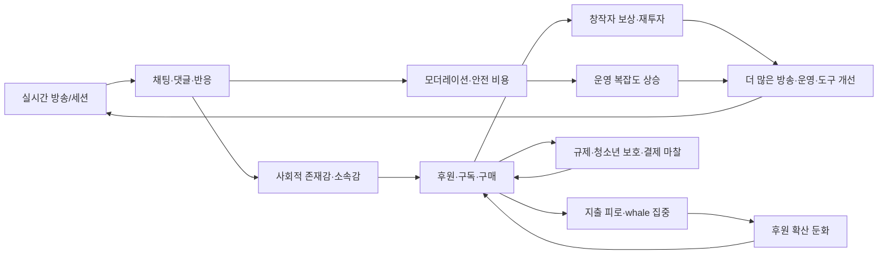
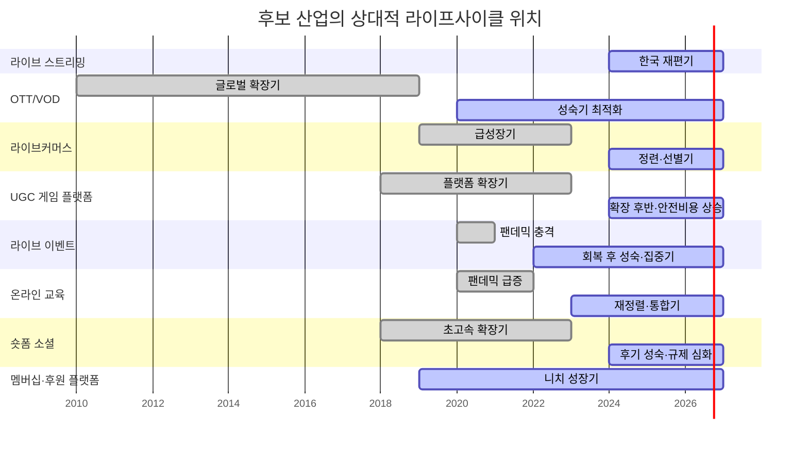

# 라이브 스트리밍의 동형 산업 비교 보고서

## Executive Summary

본 Phase3의 핵심 결론은, **라이브 스트리밍의 가장 강한 동형 후보는 비동기 구독 미디어가 아니라 “실시간 상호작용 + 가시적 사회적 신호 + 소액 반복과금 + 알고리즘/운영 개입”이 결합된 산업군**이라는 점이다. 이 기준으로 보면 **창작자 멤버십·후원 플랫폼**, **라이브커머스**, **UGC 게임 플랫폼**이 가장 높은 구조적 대응성을 보였고, **숏폼 소셜 플랫폼**과 **티켓형 라이브 이벤트**가 그 다음, **OTT/VOD**와 **실시간 온라인 교육**은 일부 층위에서 유사하지만 전체 구조 대응성은 더 낮다. 한국 라이브 스트리밍의 기준선은 치지직·SOOP·YouTube Live가 보여 주는 실시간 영상, 채팅, 후원, 구독, 모더레이션, 커머스 연동의 결합 구조이며, 이는 이미 Phase2에서 정리된 바와 같다. fileciteturn0file0 citeturn14view2turn18view0turn29view0turn36view0

특히 **피드백 축**이 결정적이다. 라이브 스트리밍은 단순히 “실시간 영상” 산업이 아니라, **시청→채팅/가시성→사회적 유대→후원/구독→창작자 보상→더 많은 방송과 운영→다시 시청 증가**라는 강화 루프 위에서 작동한다. 그러나 이 루프는 무한 증폭하지 않는다. Twitch 연구는 선물을 받은 시청자가 이후 선물을 “되갚을” 가능성이 커지지만, **상습적 기프터가 준 선물은 오히려 되갚기 확산을 약화**시킬 수 있음을 보여 준다. Patreon은 창작자에게 10%의 수수료와 각종 결제·환전·정산 비용 구조를 적용하고, iOS 결제정책 변화는 창작자와 후원자의 잉여를 다시 압박한다. 즉, 후원경제는 사회적 확산이 되지만 동시에 **지출 피로, 집중도 과다, 플랫폼 통행세, 규제 개입, 창작자 번아웃** 때문에 자기제한적이다. citeturn32academia1turn18view0turn12news2turn17view0

산업 수명주기 측면에서도 차이가 뚜렷하다. OTT는 광고요금제·라이브 프로그램·가격 실험을 동반한 **성숙기 최적화** 단계에 가깝고, 라이브커머스는 홈쇼핑형 구조에서 소셜형 구조로 이동했지만 일부 선행 사업자들의 재무 압박이 드러나는 **성장 이후 선별·정련기**에 있다. UGC 게임은 여전히 성장하지만 Trust & Safety와 연령인증 비용이 커지는 **확장기 후반**이고, 라이브 이벤트는 공연·티켓팅 초대형 플레이어 중심의 **성숙·집중기**다. 온라인 교육은 팬데믹 특수 이후 통합과 재편이 진행되는 **재정렬기**, 숏폼 소셜은 규제·감사·중독성 설계 논쟁이 본격화된 **후기 성숙기**, 창작자 멤버십은 아직 대중광고 시장보다는 작지만 반복결제·직접팬 관계를 무기로 확장하는 **니치 성장기**로 보는 것이 타당하다. 한국 라이브 스트리밍은 Twitch 철수 이후의 재편을 감안하면 **재형성-초기 집중화 단계**로 보는 해석이 가장 설득력 있다. fileciteturn0file0 citeturn36view0turn41news3turn29view0turn25news0turn46news0turn40news2turn18view0

전략적으로는, 라이브 스트리밍 사업을 OTT처럼 다루면 “콘텐츠 카탈로그”와 “구독 ARPU”에 과도하게 집중하게 되고, 반대로 라이브커머스·게임·후원 플랫폼과의 동형성을 채택하면 **사회적 신호 설계, 지불 동기 분산, 후원 피로 관리, 상호작용 밀도, 운영도구, 신뢰·안전 비용**이 핵심 관리변수로 올라온다. 이 보고서의 최종 권고는 **라이브 스트리밍을 “실시간 사회-거래 시스템”으로 보고, 미디어 산업 비유와 플랫폼/게임/후원 산업 비유를 조합하는 하이브리드 프레임**을 사용하는 것이다. citeturn32academia2turn41academia2turn37view2turn18view0turn40news2

## SMT 프레임워크와 측정 지표

이 보고서는 Phase2의 라이브 스트리밍 기준선을 출발점으로, SMT를 **Surface attributes, Relational structures, Systemic/causal chains**의 세 층위로 재정의한다. 핵심은 “겉보기 유사성”과 “작동원리의 유사성”을 분리하는 데 있다. 라이브 스트리밍은 표면적으로는 영상 산업처럼 보이지만, 실제로는 게임·커머스·팬덤·후원 플랫폼의 구조를 함께 가진다. 따라서 표면-관계-체계의 순서대로 산업을 벗겨 보아야 산업 동형성 오판을 줄일 수 있다. fileciteturn0file0 citeturn36view0turn29view0turn18view0

**Surface attributes**는 사용자가 즉시 관찰 가능한 상품 형식과 거래 형식이다. 이 층에서는 동시성, 영상/텍스트/상품의 결합 정도, 주 수익원, 과금 단위, 세션 길이, 시청·참여 KPI를 본다. 실측 지표는 예를 들어 **실시간성 여부, 과금 단위가 월정액/건별결제/가상재화인지, 핵심 KPI가 시청시간·DAU·티켓수·완강률·전환율 중 무엇인지, 규제 표면이 결제·청소년·저작권·광고표시 중 어디에 걸리는지**로 구체화할 수 있다. OTT는 월정액과 광고요금제가 표면의 핵심이고, 라이브 스트리밍은 후원/구독/광고/커머스의 복합 구조가 표면에 등장한다. citeturn39view0turn14view2turn18view0turn39view2turn47view0

**Relational structures**는 누가 누구에게 가치와 신호를 주고받는지, 즉 역할 토폴로지다. 여기서 중요한 것은 창작자-플랫폼-이용자-광고주-판매자-모더레이터 사이의 상호의존성이다. 측정 지표는 **창작자 의존도, 상위 창작자 매출집중, 이용자 간 상호작용 밀도, 시청자→구매자/후원자 전환경로 길이, 커뮤니티 유지 장치, 보상 가시성, moderation load**다. 예컨대 Patreon은 “Creators. Fans. Nothing in between.”라는 직접 팬 관계를 전면에 내세우고, Roblox는 개발자 생태계를 수익의 핵심 원가 항목으로 계상하며, Zoom Education은 수업·행정·상담·이벤트를 한 플랫폼 위에서 관계적으로 연결한다. citeturn17view0turn37view2turn47view0

**Systemic/causal chains**는 시간이 지나도 유지되는 강화·균형 루프다. 여기서 보는 것은 단발 거래가 아니라 **리텐션, 지불 확산, 피로 누적, 규제 반작용, 신뢰/안전 비용, 공급 제약, 수명주기 위치**다. 측정 지표는 **코호트 유지율, paying user diffusion, spend concentration, chargeback/fraud burden, trust & safety cost ratio, 규제개입 민감도, CAC 대비 LTV, 공급확장 탄력성, 오프라인 용량제약 여부** 등이다. 라이브 스트리밍의 자기제한 메커니즘은 후원자 집중, 청소년 보호, 후원 피로, 창작자 소진, 그리고 과금·발견·안전 기능을 동시에 운영해야 하는 복합 비용에서 발생한다. 이 보고서에서 **Connection**은 구조 대응성이 높아 전략 전이가 가능한 경우, **Gap**은 표면은 비슷하지만 관계/체계가 달라 직접 전이가 부적절한 경우, **Caution**은 상당한 유사성이 있지만 규제·수명주기·비용구조 때문에 부분 적용만 가능한 경우로 정의한다. citeturn32academia1turn37view2turn40news2turn18view0

## 후보 산업과 핵심 특성

아래 표는 라이브 스트리밍과 비교할 **일곱 개 후보 산업**을, 요청된 범주인 미디어·리테일·게임·이벤트·교육·소셜 플랫폼을 모두 포함하도록 선정한 것이다. 마지막 행의 **창작자 멤버십·후원 플랫폼**은 사용자 요청의 “patronage/sponsorship economy”를 직접 비교하기 위해 별도 산업군으로 추가했다. 한국어 공식 자료는 라이브 스트리밍 기준선과 규제 맥락에서 상대적으로 풍부했고, 후보 산업의 구조 비교에는 글로벌 상장사 공시·플랫폼 운영문서·학술연구가 더 직접적이었다. fileciteturn0file0 citeturn36view0turn29view0turn26view0turn20view0turn17view1turn18view0

| 후보 산업 | 핵심 비즈니스 모델 | 주 수익원 | 대표 참여·몰입 지표 | 대표 피드백 루프 | 라이프사이클 추정 | 규제·기술 스택 | 대표 근거 |
|---|---|---|---|---|---|---|---|
| OTT/VOD 구독 미디어 | 대규모 카탈로그 기반 월정액·광고요금제 | 월 구독료, 광고, 라이브/경험 확장 | 유료멤버십, 시청시간, 해지·재가입, 검색/추천 효율 | 콘텐츠 투자 → 시청시간/대화량 → 유지/신규유입 → 재투자 | 성숙기 최적화 | 글로벌 스트리밍 CDN, 추천엔진, 콘텐츠 권리·문화쿼터 규제 | 넷플릭스는 월 구독료가 주 수익원이고 광고요금제·라이브 프로그램을 병행하며, 경쟁 대상을 사회관계망·게임까지 넓게 본다. citeturn39view0turn37view1turn36view0 |
| 라이브커머스·소셜 리테일 | 실시간 시연·설명과 즉시 구매를 결합한 판매 | 상품매출, 판매수수료, 광고/브랜드 협찬 | 시청→클릭→구매 전환, 세션별 GMV, 댓글·질문 반응 속도 | 방송 퍼포먼스/신뢰 → 댓글·질문 → 구매전환 → 판매자 재투입 | 성장 후 정련기 | 영상송출, 상품피드, 결제/정산, 재고·물류, 광고표시·소비자보호 | 라이브커머스 연구는 방송 퍼포먼스와 실시간 피드백의 상호의존성을 강조하며, IM 기반 소셜커머스 연구도 신뢰와 공동체 규범이 구매를 매개한다고 본다. 전통 TV쇼핑/QVC는 경쟁 격화로 구조조정 압박을 받았다. citeturn41academia2turn41academia4turn41news3 |
| UGC 게임 플랫폼 | 개발자 생태계와 이용자 체류를 결합한 가상경제 | 가상재화, 수수료, 광고, 개발자 생태계 수수료 | DAU, engaged hours, bookings, 개발자 지급액 | 더 많은 개발자/콘텐츠 → 더 많은 체류/지출 → 더 많은 개발자 보상 | 확장기 후반 | 게임엔진, 실시간 멀티플레이, 결제·가상화폐, Trust & Safety, 연령인증 | Roblox는 2026년 1분기 132M DAU, 31B 시간, 17억 달러 bookings를 기록했고 DevEx·Trust & Safety 비용이 함께 급증했다. citeturn29view0turn37view2turn39view1 |
| 티켓형 라이브 이벤트 | 물리적 현장성과 희소성을 파는 프로모션·티켓팅 | 티켓, 서비스수수료, 스폰서십·광고, 부대매출 | 팬 수, 이벤트 수, 티켓 판매량, 재방문·예매 속도 | 화제성/라인업 → 수요 폭증 → 티켓 매출·스폰서 수익 → 더 큰 공연 투자 | 성숙·집중기 | 티켓팅 시스템, 좌석/용량관리, 현장 운영, 반독점·봇 규제 | Live Nation은 2025년에 159M 팬, 55,000개 이벤트, 346M fee-bearing tickets를 보고했고, 동시에 티켓팅 시장 지배력과 봇 대응이 규제 쟁점이다. citeturn26view0turn38view0turn38view1turn25news1 |
| 실시간 온라인 교육·코호트 러닝 | 수업·자격·기업교육을 온라인으로 제공 | 수강료, 기업계약, 학위/자격 인증 | 등록자 수, 수업참여, 완강률, 학습시간, 자격 공유/고용성과 | 수업경험·학습성과 → 수강 지속·자격 공유 → 신규 등록·기관 계약 | 팬데믹 후 재정렬기 | 화상회의, LMS, 캡션/전사, 참여추적, 시험감독, 교육·개인정보 규제 | Coursera는 대학·기업 파트너 기반 대규모 학습 플랫폼이며, Zoom Education은 하이브리드 수업·요약·전사·LMS 연동·시청추적을 제공한다. Coursera-Udemy 통합은 업계 재편 신호다. citeturn20view0turn47view0turn46news0turn46academia8 |
| 숏폼 소셜 플랫폼 | 알고리즘 추천을 통한 광고 기반 주의력 시장 | 광고, 크리에이터 프로그램, 쇼핑·제휴 | 도달, 체류, 반복방문, 추천 피드 소비량 | 더 긴 체류 → 더 많은 광고/창작 유인 → 더 많은 콘텐츠 → 더 긴 체류 | 후기 성숙기 | 추천 알고리즘, 대규모 모바일 비디오 인프라, 광고/연구 API, 청소년 보호 규제 | TikTok은 공식 뉴스룸에서 10억 명 이상에 대한 스토리텔링 영향력을 강조했고, TikTok Lite 보상기능은 EU에서 중독 설계 우려로 철회됐다. citeturn17view1turn30news0turn40news2turn40academia7 |
| 창작자 멤버십·후원 플랫폼 | 팬이 정기결제·일회성 구매로 창작자를 직접 후원 | 월/연 구독, 일회성 결제, 디지털 상품 | patron 수, 결제 유지율, tier 전환, 커뮤니티 활동 | 직접 팬 관계 → 반복 결제/커뮤니티 → 창작 지속 → 더 강한 팬 결속 | 니치 성장기 | 멤버십·결제·세금·정산·DM/채팅·라이브 | Patreon은 10% 수수료에 더해 결제·환전·정산 비용 구조를 두며, 네이티브 비디오와 라이브스트리밍·DM·채팅을 통합한다. Apple 인앱결제 이슈는 수익배분의 외생 리스크다. citeturn18view0turn17view0turn12news2 |

이 표의 함의는 단순하다. **라이브 스트리밍과 가장 잘 닮은 산업은 “콘텐츠 산업”이 아니라 “상호작용을 통해 경제적 신호가 증폭되는 산업”**이라는 점이다. 다시 말해, 수익구조만 비슷한 OTT보다도, **관계구조와 피드백 사슬이 유사한 멤버십·게임·라이브커머스**가 더 유용한 비교대상이다. citeturn32academia2turn32academia1turn41academia2turn37view2turn18view0

## 산업별 SMT 비교와 Connection·Gap·Caution 판정

다음 표는 각 산업을 라이브 스트리밍과 비교한 **핵심 SMT 대응성 평가표**다. Surface는 겉모습과 거래 형식, Relational은 행위자 결합 구조, Systemic는 피드백·수명주기·외생 리스크를 본다. 마지막 열의 **피드백 축 메모**는 후원/스폰서십 경제의 자기제한성과 어디서 구조를 빌려와야 하는지에 대한 판단이다. 표의 평가는 수치적 회귀모형이 아니라, 공시·운영문서·학술연구를 묶은 **구조적 판정**이다. fileciteturn0file0 citeturn39view0turn41academia2turn29view0turn26view0turn47view0turn17view1turn18view0

| 산업 | Surface 판정 | Relational 판정 | Systemic 판정 | 피드백 축 메모 | 종합 |
|---|---|---|---|---|---|
| OTT/VOD | **Connection**. 영상 소비, 구독, 광고요금제, 라이브 확장이라는 표면은 닮았다. citeturn39view0turn37view1 | **Gap**. 이용자 간 상호작용과 창작자-시청자 직접 경제가 약하다. 라이브 스트리밍의 채팅/후원/공동현존 구조가 없다. citeturn39view0turn14view2 | **Caution**. 광고요금제와 가격 실험은 참고 가능하지만, 광고 과다와 콘텐츠 과잉은 체류를 깎아 수익을 되치기한다. citeturn37view1turn33news3 | “콘텐츠 카탈로그 최적화”는 참고하되, 후원경제 이해에는 부적합하다. | **중하** |
| 라이브커머스 | **Connection**. 실시간 진행, 댓글 Q&A, 방송 중 전환이 라이브 스트리밍과 가장 표면적으로 가깝다. citeturn41academia2turn41academia4 | **Connection**. 호스트-시청자-상품-플랫폼의 다면관계, 신뢰 형성, 실시간 반응이 매우 유사하다. citeturn41academia2turn41academia4 | **Caution**. 후원 대신 구매가 핵심이라 지출동기가 “지지”가 아니라 “상품 가치”에 묶인다. 전환 압박이 커지면 피로와 신뢰 저하가 빨라진다. 기존 TV쇼핑의 구조조정이 이를 보여 준다. citeturn41news3 | 라이브 스트리밍의 커머스화 전략에는 최적의 비유지만, 커뮤니티 지속성은 더 약하다. | **상** |
| UGC 게임 플랫폼 | **Caution**. 비디오는 아니지만 실시간 참여·가상재화·세션형 몰입은 유사하다. citeturn29view0turn37view2 | **Connection**. 개발자·플랫폼·플레이어의 삼각관계, 가상경제, 커뮤니티 규칙, 보상 가시성이 라이브 스트리밍과 매우 닮았다. citeturn29view0turn21academia11 | **Connection**. creator payout 확대와 함께 Trust & Safety 비용이 상승하는 구조는 라이브 스트리밍의 후원경제 자기제한과 유사하다. citeturn37view2turn21news2turn21academia10 | “가상재화 + 이용자 생성 공급 + 안전비용 급증”은 라이브 스트리밍의 핵심 참고축이다. | **상** |
| 티켓형 라이브 이벤트 | **Connection**. 실시간성·희소성·공동현존이라는 표면은 강하게 닮았다. citeturn38view0turn39view2 | **Caution**. 이벤트는 물리적 용량과 일정 제약이 절대적이어서 일상적 반복 상호작용이 약하다. citeturn38view1turn39view2 | **Gap**. 핵심 제약이 좌석/장소/일정이고, 후원보다 티켓 선매·스폰서 비중이 높다. 라이브 스트리밍의 “항시 접속형 경제”와 다르다. citeturn38view1turn25news1 | 희소성·의례성 전략에는 유효하지만, 일상 리텐션 전략은 직접 이식하기 어렵다. | **중** |
| 실시간 온라인 교육 | **Connection**. 실시간 화상, 채팅, 캡션, 세션 운영은 비슷하다. citeturn47view0turn44academia3 | **Gap**. 관계의 핵심이 팬덤·후원이 아니라 교수자-학습자-기관-자격 인증이다. citeturn20view0turn46academia8 | **Caution**. 참여·피드백 도구는 배울 점이 크지만, Zoom fatigue와 학습 피로가 상호작용을 제한한다. 팬데믹 후 업계 통합 또한 성장 지속성이 약화되었음을 시사한다. citeturn44academia0turn44academia3turn46news0 | 라이브 운영도구·참여 추적은 참고 가치가 높으나, 후원경제 비유로는 약하다. | **중하** |
| 숏폼 소셜 플랫폼 | **Connection**. 세로형 영상, 피드 기반 발견, 크리에이터 경제, 실시간 요소 결합이 표면적으로 가깝다. citeturn17view1turn30news0 | **Caution**. 관계 구조의 중심이 “creator-community”보다는 “algorithm-user”에 있다. 즉 팬덤보다 추천이 더 강한 매개다. citeturn17view1turn40academia9 | **Caution**. 무한스크롤·보상설계는 강력한 성장엔진이지만 규제와 설계 수정 리스크가 크다. citeturn30news0turn40news2turn40academia7 | 발견 엔진을 배우기엔 최적, 그러나 후원경제를 그대로 옮기면 규제 리스크가 커진다. | **중상** |
| 창작자 멤버십·후원 플랫폼 | **Connection**. 구독, 일회성 결제, exclusive content, 채팅은 라이브 스트리밍의 후원 표면과 가장 가깝다. citeturn18view0turn17view0 | **Connection**. 직접 팬 관계, tiered membership, 커뮤니티 기반 유지가 거의 동형이다. citeturn17view0turn18view0 | **Connection**. 다만 반복결제의 지갑점유 한계, 수수료·인앱 과세, churn 문제가 큰 균형 루프로 작동한다. citeturn12news2turn32academia1turn34academia2turn34academia3 | 라이브 스트리밍의 patronage 해석에는 가장 강한 아날로지다. 동시에 자기제한도 가장 잘 드러난다. | **최상** |

종합적으로 보면, **“직접팬 결제”와 “실시간 소셜 상호작용”이 모두 있는 산업일수록 라이브 스트리밍과의 동형성이 높다.** 반대로 둘 중 하나만 있으면 유사성은 급격히 떨어진다. OTT는 결제는 있으나 실시간 상호작용이 약하고, 숏폼 소셜은 상호작용과 발견은 강하지만 직접결제 비중이 상대적으로 낮다. 그래서 전략 전이의 순서는 **후원 플랫폼 → 라이브커머스/UGC게임 → 숏폼 소셜 → 이벤트 → OTT/교육** 순서가 적절하다. citeturn18view0turn41academia2turn29view0turn17view1turn39view0turn47view0

아래의 통합 매트릭스는 산업별 핵심 축을 한 번 더 압축한 것이다. “높음/중간/낮음”은 절대점수가 아니라 **라이브 스트리밍과의 상대적 구조 근접도**다. citeturn39view0turn41academia2turn29view0turn26view0turn47view0turn17view1turn18view0

| 산업 | 동시성 | 직접 팬/후원 적합성 | 알고리즘 발견 의존도 | 커뮤니티 밀도 | 공급 확장성 | 규제 민감도 | 라이브 스트리밍 동형성 |
|---|---|---|---|---|---|---|---|
| OTT/VOD | 낮음~중간 | 낮음 | 중간 | 낮음 | 높음 | 중간 | 중하 |
| 라이브커머스 | 높음 | 중간 | 중간 | 중간~높음 | 중간 | 중간~높음 | 상 |
| UGC 게임 플랫폼 | 높음 | 중간~높음 | 높음 | 높음 | 높음 | 높음 | 상 |
| 티켓형 라이브 이벤트 | 높음 | 낮음~중간 | 낮음 | 높음 | 낮음 | 높음 | 중 |
| 실시간 온라인 교육 | 높음 | 낮음 | 낮음~중간 | 중간 | 높음 | 높음 | 중하 |
| 숏폼 소셜 플랫폼 | 중간 | 낮음~중간 | 매우 높음 | 중간 | 매우 높음 | 매우 높음 | 중상 |
| 창작자 멤버십·후원 플랫폼 | 중간 | 매우 높음 | 낮음 | 높음 | 중간 | 중간 | 최상 |

## 피드백 루프와 산업 수명주기

라이브 스트리밍의 피드백 구조를 가장 잘 설명하는 방식은, **강화 루프 하나와 균형 루프 하나가 동시에 작동한다**는 것이다. 강화 루프는 커뮤니티와 지불을 증폭시키고, 균형 루프는 피로·규제·비용으로 그것을 다시 눌러 준다. 다른 후보 산업들이 라이브 스트리밍과 얼마나 닮았는지는 결국 이 두 루프의 형태가 얼마나 비슷한지에 달려 있다. Twitch의 가상 선물 연구, Patreon의 가격·정산 구조, Roblox의 DevEx와 Trust & Safety 비용, TikTok Lite 보상기능에 대한 규제개입은 모두 “상호작용을 돈으로 바꾸는 시스템은 자기증폭도 빠르지만 자기제한도 빠르다”는 점을 보여 준다. citeturn32academia1turn18view0turn37view2turn30news0turn40news2

후원경제의 **자기제한 메커니즘**은 네 가지로 요약된다. 첫째, **확산의 비선형성**이다. 선물을 받은 시청자가 다시 선물할 확률은 올라가지만, 기부가 상습적 소수에게 집중되면 일반 이용자의 되갚기 동기는 오히려 약해질 수 있다. 둘째, **지갑점유율의 상한**이다. Patreon처럼 반복결제는 안정적이지만, 월정액이 누적될수록 다른 구독·후원과 경쟁한다. 셋째, **통행세와 정책 외생성**이다. 결제수단·앱스토어 정책 변화는 갑자기 창작자와 팬의 잉여를 압축한다. 넷째, **신뢰·안전 비용의 내재화**다. Roblox처럼 creator payout이 커질수록 Trust & Safety, 인프라, 규제비용도 같이 커진다. citeturn32academia1turn18view0turn12news2turn37view2

이 자기제한은 산업마다 다른 모습으로 나타난다. OTT에서는 광고부하가 늘면 일부 사용자는 유료 전환하지만 전체 청취·시청시간과 광고수익이 더 크게 훼손될 수 있고, 라이브커머스에서는 판매 압박이 신뢰를 깎으면 전환율이 빠르게 둔화한다. 숏폼 소셜에서는 추천엔진이 체류를 늘리지만 중독 설계라는 규제반작용을 만나고, 이벤트 산업에서는 희소성이 가격을 올리지만 좌석·장소·봇 규제라는 물리적·제도적 상한이 존재한다. 교육은 상호작용 도구가 많아도 비디오 회의 피로와 학습완료율의 한계가 빠르게 등장한다. 즉, 라이브 스트리밍이 어느 산업의 구조를 차용하든 **항상 “마찰 없는 성장”이 아니라 “성장과 제약의 동시 설계”**가 본질이다. citeturn33news3turn41academia2turn30news0turn25news1turn44academia0turn44academia3

아래 도식은 이 보고서가 추정한 **상대적 라이프사이클 위치**다. 이 도식은 회계적 분류가 아니라, 각 산업의 공시·규제·재편 신호를 종합한 **분석적 추정**이다. 예컨대 넷플릭스의 광고요금제·라이브, Live Nation의 시장집중·반독점 이슈, Coursera-Udemy 통합, TikTok의 DSA 조사, Patreon의 가격/결제정책 변화는 모두 “대규모 성장 이후 최적화 또는 재편 단계”를 시사한다. 반면 한국 라이브 스트리밍은 Twitch 철수 이후 플랫폼 재편이 아직 진행 중이므로 성숙기라기보다 **재형성 단계**로 보는 편이 더 정확하다. fileciteturn0file0 citeturn37view1turn25news1turn46news0turn40news2turn12news2

## 전략적 함의와 리스크

전략적으로 가장 중요한 시사점은, 라이브 스트리밍을 **“비디오 미디어”로만 정의하면 중요한 설계변수를 놓친다**는 점이다. OTT식 사고는 카탈로그, IP, 가격제, 광고 인벤토리에 집중하게 만든다. 그러나 라이브 스트리밍의 성패는 더 자주 **채팅 밀도, 팬 간 가시성, 후원 동기의 분산 여부, 커뮤니티 규칙, 창작자 도구, 정산 구조, 지불 마찰, 안전 비용**에서 갈린다. 따라서 사업 설계의 1차 비교산업은 OTT가 아니라 **멤버십 플랫폼·라이브커머스·UGC 게임**이어야 한다. OTT 비유는 보조 축으로 쓰는 편이 낫다. citeturn18view0turn41academia2turn29view0turn39view0

수익화 전략은 **“후원 단일축”이 아니라 다중 수익 포트폴리오**로 설계하는 것이 바람직하다. Patreon이 membership과 one-time payment, digital products를 함께 제시하고, Netflix가 광고요금제와 구독을 병행하며, Live Nation이 티켓·수수료·스폰서십을 병렬로 가지는 이유는 모두 동일하다. 한 축에 과도하게 의존하면 피드백 루프가 더 빨리 포화된다. 라이브 스트리밍도 후원·구독·광고·커머스·오프라인 이벤트·브랜드 딜을 서로 보완재로 설계해야 후원 피로를 늦출 수 있다. citeturn18view0turn39view0turn39view2

리스크는 다섯 가지가 구조적으로 크다. 첫째, **whale concentration risk**다. 소수 고액 후원자에 매출이 몰리면 단기 효율은 좋아도 장기 확산이 약해진다. 둘째, **regulatory design risk**다. 한국의 유료후원 제한과 글로벌 플랫폼의 중독성 설계 규제는 모두 라이브 스트리밍에 직접 연결된다. 셋째, **trust & safety cost inflation**이다. Roblox 사례처럼 성장할수록 안전·검열·연령보호·인프라 비용이 구조적으로 상승한다. 넷째, **platform toll risk**다. 앱스토어·결제사업자·정산정책이 외생 변수로 작동한다. 다섯째, **creator labor burnout**이다. 실시간 산업은 비동기 미디어보다 공급자의 감정노동과 운영노동이 훨씬 크다. citeturn32academia1turn37view2turn12news2turn40news2turn44academia0

따라서 실행 원칙은 명확하다. **발견(discovery)은 숏폼 소셜에서, 전환(conversion)은 라이브커머스에서, 유지(retention)는 멤버십 플랫폼에서, 공급 확장(supply scaling)은 UGC 게임에서, 의례화(ritualization)는 라이브 이벤트에서 배워야 한다.** 반면 OTT와 온라인 교육으로부터는 가격제·아카이브·전사·캡션·운영도구·하이브리드 접근만 선택적으로 가져오는 것이 바람직하다. 이 조합은 라이브 스트리밍을 “콘텐츠 사업”으로 축소하지 않으면서도, 실시간 사회-거래 시스템으로서의 구조를 더 정확히 포착한다. citeturn17view1turn41academia2turn18view0turn29view0turn39view2turn47view0

마지막으로, 동형성은 곧바로 모방을 뜻하지 않는다. **Connection은 전략 전이 가능성**, **Gap은 전이 비용 초과 가능성**, **Caution은 전이 조건을 선별해야 한다는 신호**다. 본 보고서의 해석에 따르면 라이브 스트리밍은 앞으로도 “한 산업”으로 수렴하기보다, **후원 플랫폼의 결제 구조, 게임의 커뮤니티 경제, 라이브커머스의 전환 설계, 숏폼 소셜의 발견 엔진, 이벤트의 희소성 관리**가 결합된 복합형으로 진화할 가능성이 높다. 바로 그 점이 이 시장의 성장기회이자 동시에 가장 큰 운영 리스크다. citeturn18view0turn29view0turn41academia2turn17view1turn26view0